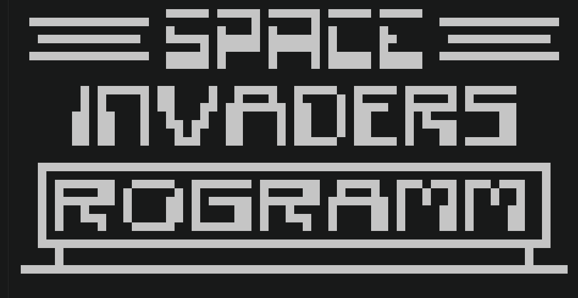

# CHIP-8 Emulator in Rust

A CHIP-8 virtual machine written in Rust that runs natively inside the terminal. Built without any dependencies. Leverages direct UNIX system calls and multi-threading for responsive low-level emulation.

## Key Technical Features

* `termios` raw-mode handling for instant input polling
* **Asynchronous Input Architecture**
* **ANSI Terminal Rendering:**
* All 35+ core CHIP-8 opcodes implemented with a strongly-typed enum decoder backed by comprehensive unit tests.

## Example Output


## Running & Testing

**2. Run the test suite:**
```bash
cargo test
```

**3. Run the emulator:**
Place a ROM (e.g., `SpaceInvaders.ch8`) in the project root and run in release mode:
```bash
cargo run --release
```

## Controls (Keypad Mapping)

The original CHIP-8 hexadecimal keypad is mapped to a modern keyboard as follows:

| CHIP-8 Key | Keyboard Key |
| :---: | :---: |
| `1` `2` `3` `C` | `1` `2` `3` `4` |
| `4` `5` `6` `D` | `q` `w` `e` `r` |
| `7` `8` `9` `E` | `a` `s` `d` `f` |
| `A` `0` `B` `F` | `y` `x` `c` `v` |